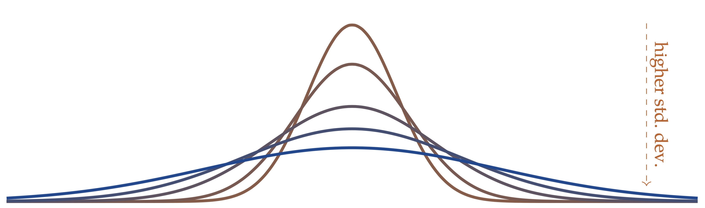
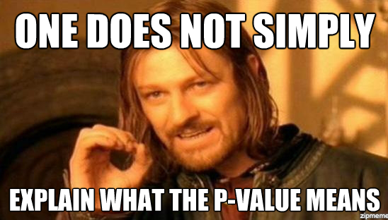
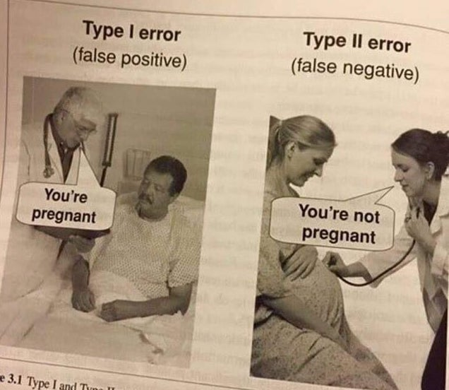

# Concepts and Background

## Some general points about the class

There might be some points we I explain something oddly or in a way that just does not click for you. In this case, please ask. Statistics is a little bit weird sometimes and there is no shame in not getting something the first time---As a case in point: I took my intro to stats twice.

We will see how far we get each session. It is no problem at all if we do not cover all the material that is on the website for each slot. So, again, please ask any questions you may have.

All the code is available on the website (with a handy button that pops up to copy it to your clipboard)---except for code for most of the plots. So please do not spend the time to copy the code by hand.

All the data sets that I use are on github here: https://github.com/mkthalmann/intro-stats in the folder `assets/data/`. Please feel free to download them and play around. The code for the plots (and everyting else) can be found in the `.Rmd` files.

The code for our practice sessions can be found on GitHub as well: `assets/scripts/`.

If you want to make sure you have all the relevant packages you need for the class here, these are the main ones:

```{r packages, eval=FALSE}
pkg <- c(
    "here", # better working directory
    "tidyverse", # data wrangling and plotting
    "broom", # tidy lm summary
    "afex", # ANOVA and linear mixed models
    "lme4" # linear mixed models
)
install.packages(pkg)
```

To load the packages, you can use the `library()` command with the (unquoted) package name.

If you ever need a refresher on how a function works, say `sum()`, you can use the `?` call:

```{r gettinghelp}
?sum
```


## On inferential statistics

In essence, what we want to do is this: Find out which portions of variance in the sample are
systematic (a pattern; introduced by us) and those which are unsystematic (coincidence; essentially
random from the perspective of our experiment) and then try to relate this to the (unknown)
population.

Along the way, we will often see this intuition play out by dividing some measure of an effect (like the mean) by a measure of uncertainty (unsystematic variance, often the standard deviation in some form). To foreshadow a bit, both meansures of effect size -- like Cohen's $d$ -- and Pearson's correlation coefficient $r$ show this signal-to-noise ratio. And if you dive a bit deeper, it pops up all over the place -- one such place is the $t$ statistic we use to get a $p$ value for the $t$-test, see below:

This is, our intuitive formula,

$$\mathit{signal-to-noise ratio} = \frac{\mathit{systematic\ variance}}{\mathit{unsystematic\ variance}}$$,

looks very similar to the one for the $t$ statistic:

$$t = \frac{\bar{x}_1-\bar{x}_2}{\mathit{SE}}$$

So we take a sample and measure some quantity and then we draw an inference towards the population. Our ingredients for this are always the same: effect size (namely a difference in measurements), variability, and sample size.

Note that **the population** is not actually easily defined in linguistics. Certainly, we want to talk about speakers of a language or dialect as a (large but finite) population. But there is another answer to the population question, and that has to do with the linguistic material. And as generative system, the population we want to generalize towards is often infinite. 

In fact, despite the centrality of this question and its potential answers, we will postpone this discussion until the very end. The point where we say that speakers and potential sentences (whatevery exactly that means) are a part of our relevant populations will be the point where we will discuss (linear) mixed models, the new workhorse in linguistic experiments and corpus analyses. 

![Systematic vs unsystematic variance, from @claude2010machine[101]](assets/media/darts.JPG)

## A note on frequentism

Frequentism, the (class of) approach(es) we will follow in this course, interprets probabilities as relative frequencies over lots of samples from a population.

So, to use old example, a single coin toss does not have a meaningful probability. Rather, in the long run (as the number of samples approach infinity), we expect a fair coin to approach a probability of $.5$ for either result.

This intuition will pop up all over the place, most prominently with confidence intervals.

### Measures of Central Tendency

Often, we will work with **means**, a measure of central tendency.

$$\bar{x}={\frac {1}{n}}\sum _{i=1}^{n}a_{i}={\frac {a_{1}+a_{2}+\cdots +a_{n}}{n}}$$

```{r mean}
mean(1:10)
```

```{tikz means, echo=FALSE, fig.cap = "Means as a location parameter.", engine.opts = list(template = "assets/latex/tikz2pdf.tex")}
\begin{tikzpicture}
		\begin{axis}[
				no markers,
				domain=5:125,
				, samples=100
				, ymin=0.0001
				, ymax=0.07
				, axis lines*=left
				, xlabel=
				, every axis y label/.style={at=(current axis.above origin),anchor=south}
				, every axis x label/.style={at=(current axis.right of origin),anchor=west}
				, height=5cm
				, width=15cm
				, xtick=\empty
				, ytick=\empty
				, enlargelimits=false
				, clip=true
				, axis on top
				, grid = major
				, hide y axis
				, hide x axis
			]

			\pgfplotsinvokeforeach{25, 45, 65, 85, 100}{
				\addplot [ultra thick, smooth, mygreen!#1!myred] {gauss(x,#1,7)};
				% node [pos=0.5, anchor=mid west, xshift=10em,append after command={(\tikzlastnode.west) edge [draw=none] +(-27em,0)}] {{\small $s=#1$}};
			}
			\draw[->, myred, dashed,postaction={decorate,decoration={text along
								path,text align=center,raise=1ex,text={|\color{myred}|higher mean}}}] (axis cs:25,0.06) --  (axis cs:100,0.06);
		\end{axis}
	\end{tikzpicture}
```


Measures of central tendency are the most vital indexes of
experimental results.

They indicate where the mass of your measured property is located.

Though you will work with means most often, we will touch on some others as well.

The **median** always leads to a bipartition of the data. The partition on a set $A$ is defined as
having the following properties \parencite[46]{partee1990mathematical}:

> for any two distinct subsets, candidates for cells of a partition of $A$, $X$ and $Y$: $X \cap Y = \emptyset$, and the union of all partitions must equal $A$: for two partitions $X$ and $Y$, $X \cup Y = A$

To calculate the mean, we just do the following:

\[\tilde{x}=\begin{cases}
		x_{\frac{n+1}{2}}                                             & n\text{ odd}   \\
		\frac{1}{2}\left(x_{\frac{n}{2}} + x_{\frac{n}{2} + 1}\right) & n \text{ even} \\
	\end{cases}\]

```{r median}
median(1:10)
```

This partition property is illustrated below for a normally-distributed data set:

```{tikz medians, echo=FALSE, fig.cap = "Medians as partitions.", engine.opts = list(template = "assets/latex/tikz2pdf.tex")}
\begin{tikzpicture}[scale=.8]
    \begin{axis}[
            no markers
            , domain=-0:10
            , samples=100
            , ymin=0
            , axis lines*=left
            , xlabel=
            , every axis y label/.style={at=(current axis.above origin),anchor=south}
            , every axis x label/.style={at=(current axis.right of origin),anchor=west}
            , height=5cm
            , width=15cm
            , xtick=\empty
            , ytick=\empty
            , enlargelimits=false
            , clip=false
            , axis on top
            , grid = major
            , hide y axis
            , hide x axis
        ]
        \addplot[mygreen, ultra thick, domain=-6:0] {gauss(x, 0, 1)};
        \addplot[myred, ultra thick, domain=0:6] {gauss(x, 0, 1)};
        \addplot[black, dashed] coordinates {(0,0) (0,0.4)};
        \node[below] at (axis cs:0, -0.02)  {$\bar{x}=\tilde{x}$};
        \node[align=left] at (axis cs:-3, 0.2)  {\textcolor{mygreen}{lower partitition}\\\textcolor{mygreen}{$x_i<\tilde{x}$}};
        \node[align=right] at (axis cs:3, 0.2)  {\textcolor{myred}{upper partitition}\\\textcolor{myred}{$x_i>\tilde{x}$}};
        %\addplot [fill=mygreen!40, draw=none, domain=-3:3] {gauss(x,0,1)} \closedcycle;
    \end{axis}
\end{tikzpicture}
```

The **mode** is not often used today, though it does come up when people talk about bimodal patterns or
distributions. If you find this kind of result within one level of your experimental manipulation,
proceed with caution, as the mean is no longer a good fit for data.

```{r mode}
mode <- function(x) {
    ux <- unique(x)
    tab <- tabulate(match(x, ux))
    ux[tab == max(tab)]
}
mode(c(1, 2, 3, 4, 5, 6, 7, 7, 8, 9, 10))
```

```{tikz modes, echo=FALSE, fig.cap = "Modes.", engine.opts = list(template = "assets/latex/tikz2pdf.tex")}
	\begin{tikzpicture}[scale=.8]
		\begin{axis}[
				no markers
				, domain=-0:10
				, samples=100
				, ymin=0
				, axis lines*=left
				, xlabel=
				, every axis y label/.style={at=(current axis.above origin),anchor=south}
				, every axis x label/.style={at=(current axis.right of origin),anchor=west}
				, height=5cm
				, width=15cm
				, xtick=\empty
				, ytick=\empty
				, enlargelimits=false
				, clip=false
				, axis on top
				, grid = major
				, hide y axis
				, hide x axis
			]
			% normal black
			\addplot[black, dashed, domain=-6:6] {gauss(x, 0, 1)};
			\addplot[black, dashed] coordinates {(0,-0.04) (0,0.4)};
			\node[below] at (axis cs:0, -0.03)  {$\bar{x}=\tilde{x}$};
			% left mode plus plot
			\addplot[mygreen, ultra thick, domain=-6:0] {gauss(x, -3, 1)};
			\addplot[myred, dashed] coordinates {(-3,-0.04) (-3,0.4)};
			\node[below] at (axis cs:-3, -0.03)  {\textcolor{myred}{mode}};
			% right mode plus plot
			\addplot[mygreen, ultra thick, domain=0:6] {gauss(x, 3, 1)};
			\addplot[myred, dashed] coordinates {(3,-0.04) (3,0.4)};
			\node[below] at (axis cs:3, -0.03)  {\textcolor{myred}{mode}};

		\end{axis}
	\end{tikzpicture}
```

### Measures of Dispersion

Measures of dispersion, different from the location measures we saw before, index the spread of a
finding, where a low value always indicates more precision/homogeneity.

Most often, these are used to indicate uncertainty and, hence, non-systematic variance.

Though we do want to minimize the spread of a data, too little spread is not a good thing either:
Without any variance at all, most statistical techniques fail outright or become unreliable.

Too little variance can also indicate that something went wrong. If a fellow linguist told
you that, in their behavioral experiments, all people from one group produced exactly (or close to)
the same results, chances are you wouldn't believe them.

**Sums of squares**

Sums of squares are a way to indicate the general deviation of a set of samples from the (group)
mean. Though this is not often mentioned in papers, this technique underlies most classical tests in
statistics.

When people talk about OLS (Ordinary Least Squares) regression, they are describing a technique
where a line is fit to the data that minimizes squared differences from the mean.

Tests of this type are ANOVA, the $t$-test, and Linear Mixed Models. More
succinctly, the sum of squared differences is calculated as follows:

$$\mathit{SumSq} = \sum _{i=1}^{n}(x_i-\bar{x})^2$$

```{r sumsq}
sumsq <- function(x) {
    sum((x - mean(x))^2)
}
sumsq(1:10)
```

```{tikz deviations, echo=FALSE, fig.cap = "Mean deviations.", engine.opts = list(template = "assets/latex/tikz2pdf.tex")}
\begin{tikzpicture}[scale = .65]
    \begin{axis}[
            no markers,
            , ymin=0
            , axis lines*=left
            , xlabel=
            , every axis y label/.style={at=(current axis.above origin),anchor=south}
            , every axis x label/.style={at=(current axis.right of origin),anchor=west}
            , height=5cm
            , width=15cm
            , xtick=\empty
            , ytick=\empty
            , enlargelimits=false
            , clip=false
            , axis on top
            , grid = major
            , hide y axis
            , hide x axis
        ]
        \addplot[myred, ultra thick] coordinates {(-3,0.2) (3,0.2)};
        \node[] at (axis cs:-2.9,0.21) {\textcolor{myred}{\LARGE $\bar{x}$}};

        \draw[mygreen, dashed] (axis cs:2.5,0.2) -- (axis cs:2.5,0.4) node {$\color{mygreen}\Large\bullet$};
        \draw[mygreen, dashed] (axis cs:1.5,0.2) -- (axis cs:1.5,0.3) node {$\color{mygreen}\Large\bullet$};
        \draw[mygreen, dashed] (axis cs:0.5,0.2) -- (axis cs:0.5,0) node {$\color{mygreen}\Large\bullet$};
        \draw[mygreen, dashed] (axis cs:-2.5,0.2) -- (axis cs:-2.5,0) node {$\color{mygreen}\Large\bullet$};
        \draw[mygreen, dashed] (axis cs:-1.5,0.2) -- (axis cs:-1.5,0.4) node {$\color{mygreen}\Large\bullet$};
        \draw[mygreen, dashed] (axis cs:-0.5,0.2) -- (axis cs:-0.5,0.1) node {$\color{mygreen}\Large\bullet$};
    \end{axis}
\end{tikzpicture}
```

The solution: Squaring the differences to remove the sign (and by transforming distances from the
mean into planes):

```{tikz sumsofsquares, echo=FALSE, fig.cap = "Sums of squares.", engine.opts = list(template = "assets/latex/tikz2pdf.tex"), out.width = "50%"}
\begin{tikzpicture}
    \node[] at (-0.25,2.2) {\textcolor{myred}{$\bar{x}$}};
    \draw[draw=none, fill=mygreen!10] (0,2) -- (0,0) -- (2,0) -- (2,2) -- (0,2);
    \draw[dashed, mygreen] (0,2) -- (0,0) node {$\color{mygreen}\bullet$};
    \draw[ultra thick, myred] (-0.5,2) -- (2.5,2);
\end{tikzpicture}
```

**Variance and standard deviation**

The standard deviation is based on the variance of a sample, and in
turn, the sum squared differences from the mean. The variance is calculated like so:

$$s^2= {\frac {\sum _{i=1}^{n}(x_{i}-{\bar{x}})^{2}}{n-1}}$$

```{r var}
var(1:10)
```

Because of the squaring of the differences, however, the resulting value for variance in not on the
measure scale anymore. In fact, it is on a squared version of that. To remedy this, and to get to
the standard deviation, we simply take the root:

$$s= \sqrt{s^2} = {\sqrt{\frac {\sum _{i=1}^{n}(x_{i}-{\bar{x}})^{2}}{n-1}}}$$

```{r sd}
sd(1:10)
sqrt(var(1:10))
```

**Standard Deviation**

The larger the dispersion, the flatter our resulting curve:



**Standard Errors and Confidence Intervals**

The standard error of the mean is a measure of the
dispersion of sample means around the population mean, and decreases as a function of the root of
$n$:

$$s_{\bar{x}} = \frac{s}{\sqrt{n}}$$

```{r se}
se <- function(x) {
    sd(x) / sqrt(length(x))
}
se(1:10)
```


Note that this measure is powerful because it takes the sample size into account. While we saw with, say, the standard deviation features, this is done to create sort of a mean of variance. Here, the use is different: We will obtain smaller standard errors (which will make us more sure about the precision of our measurement) as a function of sample size. Measuring the same variance of two samples, we could use the standard error to relate the two in terms of precision such that the larger sample makes us more confident.

Confidence intervals for the mean give us a range of values
around the mean where we expect the ``true'' (population) mean is located.

To quantify the level of certainty we're comfortable with, often 95\% is chosen (in analogy to
$p$-values). The sample mean plus or minus $1.96$ times its standard error gives us the 95\%
confidence interval:

$$CI_{95} = \bar{x} \pm SE_{\bar{x}}*1.96$$

**But how do you interpret confidence intervals?**

Like so: 95\% of 95\% confidence intervals contain
the true (population) parameter you are trying to approximate using your experiment (most generally
the mean).

In a parallel fashion, or 90\% confidence intervals, out of a 100, 90 will contain the true parameter.

This also means that 95\% confidence intervals will always be wider than 90\% ones if they are based
on the same data: If you can only be wrong 5\% of the time, you will be less sure than if you can be
wrong in a tenth of all cases.


## Hypotheses

### Null Hypothesis

People are often confused as to why they should think about a null hypothesis in the first place.

After all, the only thing we care about is our actual (in statistics parlance alternative)
hypothesis. One clue to answering this question is below:

> The key idea for inferential statistics is as follows: If we know what a “random” distribution
> looks like, we can tell random variation from non-random variation. We will start by supposing
> that the variation observed is random -- and then try to prove ourselves wrong. This is called
> ``Making the null hypothesis.'' @vasishth2010foundations

Another clue is this: $p$-values do not say anything about the alternative hypothesis at all.

<center>

</center>

They only inform us about how likely our data are given the assumption that the null hypothesis
holds.

Naturally, this is rarely the question we want answered, but it is the only answer that can
be answered meaningfully using frequentist statistics.

```{tikz nullhyp, echo=FALSE, fig.cap = "Null hypothesis.", engine.opts = list(template = "assets/latex/tikz2pdf.tex"), out.width="50%"}
\begin{tikzpicture}
		% axes and labels
		\draw[thin] (0,7) node (yaxis) [above] {} |- (10,0) node (xaxis) [above] {};
		\foreach \y in {1.75,3.5,5.25}
		\draw[ultra thin, gray, draw opacity = .3] (0,\y) -- (10,\y);

		\coordinate (r1) at (2,3);
		\coordinate (r2) at (8,3);

		\draw[thin, gray] (r1) -- (r2);
		\node[scale=3, diamond, fill=myred, scale=.25] at (r1) {};
		\node[scale=3, circle, fill=mygreen, scale=.25] at (r2) {};
\end{tikzpicture}
```

The null hypothesis thus says that all differences we might observe are non-systematic, or random,
in nature such that experimental manipulations do not produce predictable results.

This is the assumption we are trying to falsify using significance tests.

In other words, we want to show that there does, in fact, exist a systematic, non-random
relationship between our factors (our manipulation) and the dependent variable (our measurement)
such that all variance is systematic (at least overwhelmingly so).

<div class="alert alert-info">

**Questions**

- What is the inherent problem of this approach, namely the primacy of the null
hypothesis within frequentist statistics --- and, in turn, the secondary role that the alternative
hypothesis plays?

</div>

### Alternative hypothesis

We predict patterns in the population, and using inference statistics we try to find evidence for
this pattern using samples of that population. And even if our statistics say that the effect we
found is systematic, it still might not be so (spurious results)

```{tikz althyp, echo=FALSE, fig.cap = "Alternative hypothesis.", engine.opts = list(template = "assets/latex/tikz2pdf.tex"), out.width="50%"}
\begin{tikzpicture}
		% axes and labels
		\draw[thin] (0,7) node (yaxis) [above] {} |- (10,0) node (xaxis) [above] {};
		\foreach \y in {1.75,3.5,5.25}
		\draw[ultra thin, gray, draw opacity = .3] (0,\y) -- (10,\y);

		\coordinate (r1) at (2,1.5);
		\coordinate (r2) at (8,5);
		\coordinate (g1) at (2,6.5);
		\coordinate (g2) at (8,2.5);

		\draw[mygreen] (g1) -- (g2);
		\draw[dashed, myred] (r1) -- (r2);
		\node[scale=3, diamond, fill=myred, scale=.25] at (r1) {};
		\node[scale=3, diamond, fill=myred, scale=.25] at (r2) {};
		\node[scale=3, circle, fill=mygreen, scale=.25] at (g1) {};
		\node[scale=3, circle, fill=mygreen, scale=.25] at (g2) {};
\end{tikzpicture}
```

Here is an illustration of the two competing hypotheses using distributions, identified by two sample means $x_1$ and $x_2$:

```{tikz althyp2, echo=FALSE, fig.cap = "Alternative hypothesis again.", engine.opts = list(template = "assets/latex/tikz2pdf.tex")}
\begin{tikzpicture}
    \begin{axis}[
            no markers
            , domain=-7.5:11.5
            , samples=100
            , ymin=0
            , axis lines*=left
            , xlabel=
            , every axis y label/.style={at=(current axis.above origin),anchor=south}
            , every axis x label/.style={at=(current axis.right of origin),anchor=west}
            , height=5cm
            , width=15cm
            , xtick=\empty
            , ytick=\empty
            , enlargelimits=false
            , clip=false
            , axis on top
            , grid = major
            , hide y axis
            , hide x axis
        ]

        % Normal Distribution 1
        \addplot[mygreen, ultra thick] {gauss(x, 0, 1.75)};
        \pgfmathsetmacro\valueA{gauss(0, 0, 1.75)}
        \draw [dashed, mygreen] (axis cs:0, 0) -- (axis cs:0, \valueA);
        \node[below] at (axis cs:0, -0.02)  {\Large \textcolor{mygreen}{$\bar{x}_{1}$}};
        \draw[thick, mygreen] (axis cs:-0.0, -0.01) -- (axis cs:0.0, 0.01);

        % Normal Distribution 2
        \addplot[myred, ultra thick] {gauss(x, 5, 1.75)};
        \draw [dashed, myred] (axis cs:5, 0) -- (axis cs:5, \valueA);
        \node[below] at (axis cs:5, -0.02)  {\Large \textcolor{myred}{$\bar{x}_{2}$}};
        \draw[thick, myred] (axis cs:5, -0.01) -- (axis cs:5, 0.01);

        \draw[gray, <->, line width = 1pt] (axis cs:0,0.1) -- (axis cs:5,0.1)
        node[anchor = north east, pos=0.5, font=\footnotesize] {};
    \end{axis}
\end{tikzpicture}
```

And here we have a comparison between the null and the alternative hypothesis:

```{tikz althyp3, echo=FALSE, fig.cap = "left: Null hypothesis, right: Alternative hypothesis..", engine.opts = list(template = "assets/latex/tikz2pdf.tex")}
\begin{tikzpicture}[scale=.7]
		\begin{axis}[
				no markers
				, domain=-0:10
				, samples=100
				, ymin=0
				, axis lines*=left
				, xlabel=
				, every axis y label/.style={at=(current axis.above origin),anchor=south}
				, every axis x label/.style={at=(current axis.right of origin),anchor=west}
				, height=5cm
				, width=9cm
				, xtick=\empty
				, ytick=\empty
				, enlargelimits=false
				, clip=false
				, axis on top
				, grid = major
				, hide y axis
				, hide x axis
			]
			\addplot[mygreen, ultra thick, domain=-4:4] {gauss(x, 0, 1)};
			%\addplot [fill=mygreen!40, draw=none, domain=-3:3] {gauss(x,0,1)} \closedcycle;
			\addplot[black, dashed] coordinates {(0,0) (0,0.4)};
			\node[below] at (axis cs:0, -0.02)  {\Large \textcolor{mygreen}{$\bar{x_{1}}$} = \textcolor{myred}{$\bar{x_{2}}$}};
		\end{axis}
	\end{tikzpicture}%
	\begin{tikzpicture}[scale=.7]
		\begin{axis}[
				no markers
				, domain=-7.5:11.5
				, samples=100
				, ymin=0
				, axis lines*=left
				, xlabel=
				, every axis y label/.style={at=(current axis.above origin),anchor=south}
				, every axis x label/.style={at=(current axis.right of origin),anchor=west}
				, height=5cm
				, width=9cm
				, xtick=\empty
				, ytick=\empty
				, enlargelimits=false
				, clip=false
				, axis on top
				, grid = major
				, hide y axis
				, hide x axis
			]

			\addplot[mygreen, ultra thick, domain=-4:5] {gauss(x, 0, 1)};
			%\addplot [fill=mygreen!40, draw=none, domain=-3:3] {gauss(x,0,1)} \closedcycle;
			\addplot[black, dashed] coordinates {(0,0) (0,0.4)};
			\node[below] at (axis cs:0, -0.02)  {\Large \textcolor{mygreen}{$\bar{x_{1}}$}};

			\addplot[myred, ultra thick, domain=-3:7] {gauss(x, 3, 1)};
			%\addplot [fill=mygreen!40, draw=none, domain=-3:3] {gauss(x,0,1)} \closedcycle;
			\addplot[black, dashed] coordinates {(3,0) (3,0.4)};
			\node[below] at (axis cs:3, -0.02)  {\Large \textcolor{myred}{$\bar{x_{2}}$}};

			%		\draw[gray, <->, line width = 1pt] (axis cs:0,0.1) -- (axis cs:5,0.1)
			%		node[anchor = north east, pos=0.5, font=\footnotesize] {};
		\end{axis}
	\end{tikzpicture}
```

## Type I and Type II errors

So, our goal is to discriminate between the null and the alternative hypothesis. Depending on our $p$-value, we will either accept the null hypothesis ($p > .05$) or reject it ($p < .05$).

But since we're always aware that we might be wrong---after all, our significance threshold has this possibility built-in by design---there a four possible outcome scenarios:

| The null hypothesis is ...  | true                             | false                            |
|-------------------------|----------------------------------|----------------------------------|
| rejected ($p < .05$)               | Type I error (false positive)    | Correct decision (true positive) |
| accepted ($p > .05$)                | Correct decision (True negative) | Type II error (false negative)   |
|                         |                                  |                                  |

<center>

</center>

A closely related concept to statistical errors is power, which is the probability of detecting an effect that is actually there. Power is determined by three things:

- Significance (higher $\alpha$ = more power)
- Sample size (larger $N$ = more power)
- Effect size (larger effect = more power) 

In principle, when designing an experiment, the only one of these factors you have any control over is the sample size. So be wary of experiments with few items and participants, both when designing your own and when reading a paper. 

In the literature you will see two kinds of power analysis mentioned, *a priori*, i.e., calculated before the study was carried out, and *post hoc*, carried out afterwards. 

The second way is seriously flawed and is dependent upon the $p$-value. So it is not useful at all. Do not do this.

## Some terms

When describing (and planning) an experiment, this is ideally done using the following terms:

- **Independent Variable**: What you manipulate.
- **Dependent Variable**: What you measure.


**Main effects** are the differences that, for example, a $t$-test is sensitive to: namely a difference
between condition means.

Here is a classical situation for a one-factorial design:

```{tikz onefactwolev, echo=FALSE, fig.cap = "One factorial design (two factor levels).", engine.opts = list(template = "assets/latex/tikz2pdf.tex"), out.width= "70%"}
	\begin{tikzpicture}[scale=.4]
		% axes and labels
		\draw[thin] (0,7) node (yaxis) [above] {} |- (10,0) node (xaxis) [above] {};
		\foreach \y in {1.75,3.5,5.25}
		\draw[ultra thin, gray, draw opacity = .3] (0,\y) -- (10,\y);

		\coordinate (r1) at (2,1.5);
		\coordinate (r2) at (8,5);

		\draw[thin, dashed, myred] (r1) -- (r2);
		\node[diamond, fill=myred, scale=.25] at (r1) {};
		\node[diamond, fill=myred, scale=.25] at (r2) {};
	\end{tikzpicture}
```

## The $t$-test

Now, let's actually get to the statistics and apply what we've learned so far.

Below, I have a data set containing (among other information), lung capacities and the smoker status of of a number of people---downloaded [here](https://www.kaggle.com/datasets/radhakrishna4/lung-capacity).

Say our (alternative) hypothesis is that smokers and non-smokers have a different lung capacity, while the null hypothesis is that there is no difference between the two. 

As always, we have no way of testing the entire population, so we will have to make do with our sample data set and draw an inference towards the state that is likely to hold in the population.

This is where the $t$-test comes in.

(I am neglecting here the one-sample $t$-test, assuming that you are already familiar, and jumping straight into the two-sample version, which is more useful for our purposes anyhow.)

```{r lungs}
lungs <- read.csv(
    here("assets", "data", "lungs.txt"),
    sep = "|",
    dec = ","
) %>%
    rename(
    "lung_cap" = Lungenkapazität,
    "age" = Alter,
    "height" = Größe,
    "smoker" = Raucher,
    "sex" = Geschlecht,
    "caesarean" = Kaiserschnitt
    )
```

We could use means, standard deviations, and the standard errors of the mean to get a sense of the data:

```{r lungsummary}
lungs %>%
    group_by(smoker) %>%
    summarise(
        lung_cap_mean = mean(lung_cap),
        lung_cap_sd = sd(lung_cap),
        lung_cap_se = lung_cap_sd / sqrt(n()),
        how_many = n()
    )
```

But it's also always good to have a plot:

```{r lungsplot, echo = FALSE, fig.cap="Smokers"}
p_lungs <- lungs %>%
    ggplot(aes(x = smoker, y = lung_cap, color = smoker, pch = smoker, group = 1)) +
    stat_summary(fun = mean, geom = "line", color = "black", alpha = .5) +
    stat_summary(fun = mean, geom = "point", size = 3) +
    stat_summary(fun.data = mean_se, geom = "errorbar", width = .15) +
    guides(color = "none", pch = "none") +
    labs(
        x = "Smoker",
        y = "Lung Capacity \u00B1 SE"
    ) +
    scale_color_manual(values = colors)
p_lungs
```

Remember, our hypothesis is that there is a difference in lung capacity with smokers and non-smokers. Thus, our **dependent variable** is the lung capacity of each person in the data set, the **independent variable** is the smoker status. And what we predict is a **main effect** of smokerdom. 

Now, say we have an argumentative friend who says the data in the plot is neither here nor there. He wants a definitive answer. While statistics is certainly not definitive, it is certainly better than nothing. So we do a $t$-test to compare the lung capacity between the two groups.

Under the hood (more on that below), the mean difference is calculated (or indicator of systematic variance) and divided by (a version of) the standard errors of each sample, which represent the variation we have no explanation for.

A larger $t$ value is then an indicator for a strong effect of the experimental manupulation, a small one suggests that most of the variation is not due to the factor of interest.

```{r lungst}
t.test(
    lung_cap ~ smoker,
    data = lungs,
    paired = FALSE,
    var.equal = TRUE,
    alternative = "two.sided"
    )
```

<div class="alert alert-info">

**Question**: So, what does this mean?

</div>

As an aside: We do not care about the sign of the $t$-value. This is only a reflex of the ordering of the grouping factor in R. If we change that, the negative sign goes away, but everything else remains the same:

```{r lungst2}
lungs %>%
    mutate(smoker = fct_relevel(smoker, "yes")) %>%
    t.test(
        lung_cap ~ smoker,
        data = .,
        paired = FALSE,
        var.equal = TRUE,
        alternative = "two.sided"
    )
```

We could report this (to our annoying friend) by saying the following:

> The difference in lung capacity between smokers and non-smokers was significant, $t(559) = -2.7, p < .05$.

This means that, under the assumption that the null hypothesis is true in the population, finding the test statistic that we found in our sample (or a more extreme one) is incredibly unlikely, namely $p = 0.0067$.

To reiterate: the $p$-value does not tell us anything about the alternative hypothesis. It only tells us that our data are very surprising if we expect the true difference to be $0$.

We often do some mental gymnastics and use imprecise/wrong formulations, but it is important to remember that a $p$-value cannot give you a full solution to your problem, it is only tool in your toolbox to argue for something (e.g. that the alternative hypothesis is true).

Normally we say that a result is statistically significant when the $p$-value is low enough, namely below the so-called $\alpha$ criterion, generally at 5%. Anything above this threshold is not surprising enough, and we conventionally say that that is not enough to establish statistical significance. But this is an **arbitrary number**---there is nothing inherent to this setting of $\alpha$ that makes it worthy as the make-it-or-break-it line over any other.

Here's the $t$-test formula given on [Wikipedia](https://en.wikipedia.org/wiki/Student%27s_t-test) (for equal or unequal sample sizes, similar variances): 

$$t = \frac{\bar{X}_1 - \bar{X}_2}{s_p * \sqrt{\frac{1}{n_1}+\frac{1}{n_2}}}$$
where $s_p$ represents the pooled variances (and thus the random variation we have no explanation for):

$$s_p = \sqrt{\frac{(n_1 - 1) s^2_{X_1} + (n_2 - 1) s^2_{X_2} }{n_1 + n_2 - 2}}$$

Note that the numerator represents the systematic variation, i.e., the difference between the two means. By dividing the systematic variance by the unsystematic one, we get an indication of how systematic the mean differences actually are.

And now let's implement this in R and see whether we can get the same results that we got above using `t.test()`.

<div class="alert alert-info">

**Task**: If you guys want to, you could do this on your own. Of course, you have my solution there but if you truly want to understand what's going on, it might be good 

</div>

```{r ttesthand}
x1 <- lungs %>%
    filter(smoker == "no") %>%
    pull(lung_cap)
x2 <- lungs %>%
    filter(smoker == "yes") %>%
    pull(lung_cap)

# means
x_bar_1 <- mean(x1)
x_bar_2 <- mean(x2)

# n_i
n_1 <- length(x1)
n_2 <- length(x2)

# variances
s_1_squared <- var(x1)
s_2_squared <- var(x2)

#pooled estimator:
s_p <- ((n_1 - 1) * s_1_squared + (n_2 - 1) * s_2_squared) / (n_1 + n_2 - 2)
s_p <- sqrt(s_p)

# calculate the t value
t <- (x_bar_1 - x_bar_2) / (s_p * sqrt(1 / n_1 + 1 / n_2))
t

# degrees of freedom
dof <- n_1 + n_2 - 2

# look up the p value in the t distribution using the degrees of freedom (two-tailed)
p <- 2 * pt(t, dof, lower.tail = TRUE)
p
``` 

And here is another way of getting the same results, the `lm()` function:

```{r ttestcheck}
t.test(lung_cap ~ smoker, data = lungs, var.equal = TRUE)
summary(lm(lung_cap ~ smoker, data = lungs))
```

## Wrap-Up

That's it for today. Here's a small recap of what we looked at:

- We talked about the primary method of inferential statistics: separating out systematic variance (the stuff that we care about) from (in the context of our experimental goal) randomness.
- Then we saw some of the estimators that play a central role in discriminating between the two. To do this, we often use the mean and variance/standard deviation.
- After that we talked about hypotheses and saw that frequentist statistics really only talks about the null hypothesis, even though we only care about the alternative hypothesis.
    - remember: the alternative hypothesis should be written down and ideally graphed **before** data collection begins to keep yourself accountable.
- Finally we worked through an example data set with the $t$-test, both with the `t.test()` function and by hand (the latter again involved the measures of central tendency and of dispersion), and tried to interpret the $p$-value both returned.

In tomorrow's class we will continue on our stats journey and talk about more complex designs.
