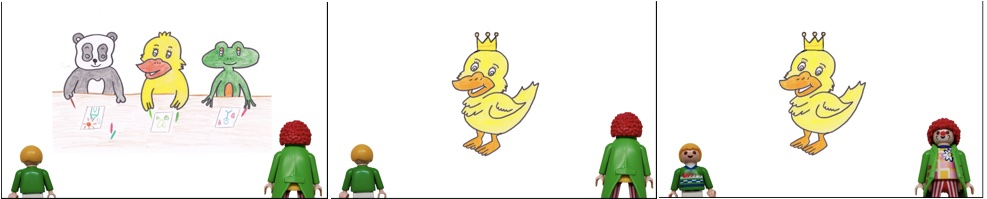

# ANOVA 

## Yesterday

So, yesterday we talked about various things:
    
  - measures of central tendency and of dispersion
  - null hypotheses and alternative hypotheses
  - a short review of the $t$ test
    
    
Today's plan is to introduce cases where we have more than independent variable---situations where we have more than one main effect. 

In these cases, our $t$-test does not work:

```{r lungsagain, error = 0}
t.test(lung_cap ~ smoker + age, data = lungs)
```

<div class="alert alert-info">
**Question:** Can you think of a reason why we cannot just several $t$-tests here? There are at least two: 

- one has to do with the kind of data we have here and 
- one has to do with a concept from yesterday: power.

</div>

This means that we need to talk about more sophisticated tests that let us draw an inference on the basis of multiple factors.

We will also talked about a very central topic in the analysis of (psycho)linguistic data: repeated measures.

In contrast to the lung capacity data we saw yesterday where every person had the lung capacity measured once, in linguistics we will often give participants multiple items of the same condition. This means that we have several data points per person per experimental condition. 

And one of our goal for today will be to integrate this design feature into our statistical toolbox.


## How to get to Rome

Before we do so, let me briefly say something about equivalence. Yesterday, we used a very specific function, namely `t.test()`, to derive our statistical result. However, especially at this simple level where we're only dealing with a single independent variable, a lot of tests will give us the same result.

Before we move on to the illustration, let me introduce a new data set. This is from an experiment I did with two colleagues of mine: Yuqui Chen and Mailin Antomo [@thalmann2022presupposition].

Here are two sample items. People saw all items (several hard and soft triggers), but only one condition per item, either the assertion was at-issue or the presupposition.

- **Soft trigger** *win*
    
    The panda, the duck, and the frog are having a drawing competition. All like the duck’s drawing the most. The duck receives a crown as a prize. The clown did not pay attention again and asks:
    a. **Assertion at-issue**:
    “Did the duck do the best at the competition?”
    b. **Presupposition at-issue**:
    “Did the duck participate in the competition?”
    
    Little Peter responds, “The duck won the competition.” 
- **Hard trigger** *again*
    
    The panda is a member of a soccer club. Recently, he has been playing very well and scored many goals in the past weeks. Yesterday there was a football game and he scored a goal. The clown did not pay attention again and asks:
    a. **Assertion at-issue**:
    “Did the panda score a goal yesterday?”
    b. **Presupposition at-issue**:
    “Did the panda score a goal for the first time yesterday?”
    
    Little Peter responds, “The panda scored a goal again yesterday.”

<center>

</center>

<center>

</center>

We will only work with a smaller set of data here. As you can see in the code below, I am excluding the children, and one level of the trigger type independent variable (namely non-restrictive relative clauses). And there is some other stuff in the columns that I am dropping here, but this level of complexity should be enough for now.


```{r dpsp, paged.print=TRUE, message=FALSE}
d_psp <- read_csv(here("assets", "data", "psp-data.csv")) %>%
    filter(trigger_cat != "appo", stage != "Children") %>%
    select(id, itemid, trigger_cat, issue, judgment)
d_psp
```
Here's a plot of the data:

```{r pspplot, echo=FALSE, message=FALSE, warning=FALSE}
d_psp %>%
    ggplot(aes(x = trigger_cat, y = judgment, color = issue, pch = issue, group = issue)) +
    stat_summary(fun = mean, geom = "line") +
    stat_summary(fun = mean, geom = "point") +
    stat_summary(fun.data = mean_se, geom = "errorbar", width = 0.1) +
    labs(
        x = "Trigger Type",
        y = "Judgment \u00B1 SE",
        color = "At-Issueness",
        pch = "At-Issueness"
    ) +
    scale_color_manual(values = colors) +
    coord_cartesian(ylim = c(1, 5))
```


Now, here's the `lm()` call that gives us the difference betweem the two trigger types (remember that this is equivalent to the $t$ test):

```{r psplm}
summary(lm(judgment ~ trigger_cat, data = d_psp))
```

And here's one more equivalent command (though you do not see the $t$ value below, if you look at the results above, you will see the $F$ value at the very bottom and that the $p$-values are the same):

```{r pspaov}
summary(aov(judgment ~ trigger_cat, data = d_psp))
```
So, in this simple case, the following three commands produce identical results: `t.test()`, `lm()`, `aov()`.

But what is this `aov()` command exactly? It stands for the test people commonly call ANOVA (ANalysis Of VAriance). For a long while it was the standard test in linguistics (and related disciplines). 

For us, it is important to understand it as an extension of the $t$-test: The two models are exactly identical in the simple case with one predictor---for the ANOVA, this is often called one-way ANOVA.

In fact, the same computation we already did for the $t$-test will show up again with the ANOVA, only the names for the parts will be different. 

Importantly, the ANOVA, but not the $t$-test, handles more complex analytical situations as well, namely ones where we want to include several independent variables. And of course, in these situations the equivalence breaks down.

What about the `lm()`? LM is short for linear model, i.e., a type of analysis that works by fitting a line by minimizing the distance of the actual observations to the line. Again, this line fitting procedure is equivalent to the ANOVA and the $t$-test in this case. 

```{r sim}
set.seed(1234)
sim <- tibble(
    a = rnorm(n = 15, mean = 2),
    b = rnorm(n = 15, mean = 3),
) %>%
    pivot_longer(cols = c(a, b), names_to = "cond")
sim
t.test(value ~ cond, data = sim, var.eqal = TRUE)
summary(lm(value ~ cond, data = sim))
summary(aov(value ~ cond, data = sim))
```
Notice here that $t^2 = F: 3.2271^2 = 10.414$. And notice that the coefficient for the slope of `cond` is the same as the mean difference we find for the $t$-test: 

```{r simt}
t.test(value ~ cond, data = sim) %>%
    tidy() %>%
    select(1:3)
```


What is important to remember is this: All of the tests we have discussed so far share a common core, and are actually mathematically identical in the simple case.

With this in mind, let's abandon the simple case and move on to repeated measures. 

## Repeated Measures

As I hinted at at the outset, we ignored a very systematic part of the variance in the model above: repeated measures. This is the situation where we have multiple data points from the same person (each person judged different items in the same condition).

While this type of systematic variance is not necessarily due to our experimental manipulations (more on that a little later when we talk about random slopes), it would be bad to ignore it because it may be a confound in our data. That is, a source of systematic variation in our data that has nothing to do with our experiment. 

To see this, let's look at some of the participants in our experiment:

```{r pspid, echo=FALSE}
d_psp %>%
    filter(id %in% unique(d_psp$id)[1:12]) %>%
    ggplot(aes(x = trigger_cat, y = judgment, color = issue, pch = issue, group = issue)) +
    geom_jitter(alpha = .2, height = 0) +
    stat_summary(fun = mean, size = 2, geom = "point") +
    stat_summary(fun = mean, size = .25, geom = "line") +
    stat_summary(fun.data = mean_se, geom = "errorbar", width = 0.1) +
    facet_wrap(~ id) +
    labs(
        x = "Trigger Type",
        y = "Judgment \u00B1 SE",
        color = "At-Issueness",
        pch = "At-Issueness"
    ) +
    scale_color_manual(values = colors) +
    coord_cartesian(ylim = c(1, 5), clip = "off") +
    theme(strip.text.x = element_markdown(size = 7))
```
As we can see, though all participants show the overall effect, they differ from each other in quite significant ways. This individual variation is something we would like to account for in our statistics.

For the `aov` function call, it is relatively easy to add repeated measures, simply add the grouping variable (the people) and the factors whose different levels were tested with each of them (trigger type) as an `Error()` term in your model. 

```{r aovrep}
anova_psp <- aov(judgment ~ trigger_cat + Error(id/(trigger_cat)), data = d_psp)
summary(anova_psp)
```

We could report this like this:

> The predicted main effect of TRIGGER TYPE was significant, $F(1,31) = 48.21, p < .001$.

A lot of people find the following ANOVA command from the `afex` package [@singmann2016afex] a little bit easier to use, so I am including it here.

```{r pspafex, message=FALSE, warning=FALSE}
library(afex)
afex_psp <- aov_ez(
    "id",
    "judgment",
    within = "trigger_cat",
    data = d_psp,
    print.formula = TRUE
)
afex_psp
```
So, what we've done so far:

We moved from the 


## Two-Way ANOVA

Let's look at the plot for the presupposition data again:

```{r pspplot2, echo=FALSE, message=FALSE, warning=FALSE}
d_psp %>%
    ggplot(aes(x = trigger_cat, y = judgment, color = issue, pch = issue, group = issue)) +
    stat_summary(fun = mean, geom = "line") +
    stat_summary(fun = mean, geom = "point") +
    stat_summary(fun.data = mean_se, geom = "errorbar", width = 0.15) +
    labs(
        x = "Trigger Type",
        y = "Judgment \u00B1 SE",
        color = "At-Issueness",
        pch = "At-Issueness"
    ) +
    scale_color_manual(values = colors) +
    coord_cartesian(ylim = c(1, 5))
```

From the plot (and the original experiment) is set up, you can see that there seems to be another factor at play: at-issueness.

In the critical items, the clowns question either targeted the foregrounded (at-issue) portion of the critical utterance or the backgrounded, presupposed material. 

As you can see, this factor seems to be quite important because it drives a quite severe judgment asymmetry for the hard triggers: When the presupposition of a hard trigger is used to answer a question, infelicity ensues. For the soft triggers, this is much less pronounced.

In what is to come, we will incorporate two factors into our model. As we saw before, the $t$-test is no longer applicable in these cases, so we will work with the ANOVA for now.


```{r}
psp_two <- aov_car(judgment ~ trigger_cat + issue + Error(id/(trigger_cat+issue)), data = d_psp)
psp_two
```

The first two lines in the table are our main effects, which say that the trigger type and at-issueness manipulations lead to significantly different judgments. 

<div class="alert alert-info">
**Question:** But what about the third line?
</div>

The third line is a so-called interaction. Recall that main effects describe significant differences. Interactions are probably best conceptualized as differences between differences.

As we saw in the plot, the at-issueness factor seems to affect hard presupposition triggers more strongly than soft ones. In a sense, we need to look at the settings of both manipulations in order to predict the judgments that participants are likely to make.

Note that this also affects our main effect for issueness. Before we simply that there is a significant difference between the two levels of this factor. However, with both the plot and the significant interaction under our belt, we now that we should be a little more careful: While there is something going on with at-issueness, the main effect is mainly driven by the hard presupposition triggers, with the soft triggers, the effect is almost negligible.


In the plots below, we have some more interactions:

- *Above*: main effect possibilities without interactions
- *below*: including interactions -- main effects determined by means, interactions by slopes.
- *Ltr/ttb*: no main effect, main effect for $x$ factor, split factor main effect, main effects for both, no main effect but interaction, $x$ factor effect plus interaction, split factor effect plus interaction, two main effects plus interaction.

```{tikz interactions2, echo=FALSE, fig.cap = "Interactions", engine.opts = list(template = "assets/latex/tikz2pdf.tex"), out.width="100%"}
	\begin{tikzpicture}[scale=.25]
		% axes and labels
		\draw[thin] (0,7) node (yaxis) [above] {} |- (10,0) node (xaxis) [above] {};
		\foreach \y in {1.75,3.5,5.25}
		\draw[ultra thin, gray, draw opacity = .3] (0,\y) -- (10,\y);

		\coordinate (r1) at (2,3.2);
		\coordinate (r2) at (8,3.2);
		\coordinate (g1) at (2,3.5);
		\coordinate (g2) at (8,3.5);

		\draw[thin, mygreen] (g1) -- (g2);
		\draw[thin, dashed, myred] (r1) -- (r2);
		\node[diamond, fill=myred, scale=.3] at (r1) {};
		\node[diamond, fill=myred, scale=.3] at (r2) {};
		\node[circle, fill=mygreen, scale=.3] at (g1) {};
		\node[circle, fill=mygreen, scale=.3] at (g2) {};
	\end{tikzpicture}%
	\hspace{.5em}%
	\begin{tikzpicture}[scale=.25]
		% axes and labels
		\draw[thin] (0,7) node (yaxis) [above] {} |- (10,0) node (xaxis) [above] {};
		\foreach \y in {1.75,3.5,5.25}
		\draw[ultra thin, gray, draw opacity = .3] (0,\y) -- (10,\y);

		\coordinate (r1) at (2,1);
		\coordinate (r2) at (8,6);
		\coordinate (g1) at (2,1.3);
		\coordinate (g2) at (8,6.3);

		\draw[thin, mygreen] (g1) -- (g2);
		\draw[thin, dashed, myred] (r1) -- (r2);
		\node[diamond, fill=myred, scale=.3] at (r1) {};
		\node[diamond, fill=myred, scale=.3] at (r2) {};
		\node[circle, fill=mygreen, scale=.3] at (g1) {};
		\node[circle, fill=mygreen, scale=.3] at (g2) {};
	\end{tikzpicture}%
	\hspace{.5em}%
	\begin{tikzpicture}[scale=.25]
		% axes and labels
		\draw[thin] (0,7) node (yaxis) [above] {} |- (10,0) node (xaxis) [above] {};
		\foreach \y in {1.75,3.5,5.25}
		\draw[ultra thin, gray, draw opacity = .3] (0,\y) -- (10,\y);

		\coordinate (r1) at (2,2);
		\coordinate (r2) at (8,2);
		\coordinate (g1) at (2,5);
		\coordinate (g2) at (8,5);

		\draw[thin, mygreen] (g1) -- (g2);
		\draw[thin, dashed, myred] (r1) -- (r2);
		\node[diamond, fill=myred, scale=.3] at (r1) {};
		\node[diamond, fill=myred, scale=.3] at (r2) {};
		\node[circle, fill=mygreen, scale=.3] at (g1) {};
		\node[circle, fill=mygreen, scale=.3] at (g2) {};
	\end{tikzpicture}%
	\hspace{.5em}%
	\begin{tikzpicture}[scale=.25]
		% axes and labels
		\draw[thin] (0,7) node (yaxis) [above] {} |- (10,0) node (xaxis) [above] {};
		\foreach \y in {1.75,3.5,5.25}
		\draw[ultra thin, gray, draw opacity = .3] (0,\y) -- (10,\y);

		\coordinate (r1) at (2,4);
		\coordinate (r2) at (8,1);
		\coordinate (g1) at (2,6.5);
		\coordinate (g2) at (8,3.5);

		\draw[thin, mygreen] (g1) -- (g2);
		\draw[thin, dashed, myred] (r1) -- (r2);
		\node[diamond, fill=myred, scale=.3] at (r1) {};
		\node[diamond, fill=myred, scale=.3] at (r2) {};
		\node[circle, fill=mygreen, scale=.3] at (g1) {};
		\node[circle, fill=mygreen, scale=.3] at (g2) {};
	\end{tikzpicture}%

	\begin{tikzpicture}[scale=.25]
		% axes and labels
		\draw[thin] (0,7) node (yaxis) [above] {} |- (10,0) node (xaxis) [above] {};
		\foreach \y in {1.75,3.5,5.25}
		\draw[ultra thin, gray, draw opacity = .3] (0,\y) -- (10,\y);

		\coordinate (r1) at (2,2);
		\coordinate (r2) at (8,6);
		\coordinate (g1) at (2,6);
		\coordinate (g2) at (8,2);

		\draw[thin, mygreen] (g1) -- (g2);
		\draw[thin, dashed, myred] (r1) -- (r2);
		\node[diamond, fill=myred, scale=.3] at (r1) {};
		\node[diamond, fill=myred, scale=.3] at (r2) {};
		\node[circle, fill=mygreen, scale=.3] at (g1) {};
		\node[circle, fill=mygreen, scale=.3] at (g2) {};
	\end{tikzpicture}%
	\hspace{.5em}%
	\begin{tikzpicture}[scale=.25]
		% axes and labels
		\draw[thin] (0,7) node (yaxis) [above] {} |- (10,0) node (xaxis) [above] {};
		\foreach \y in {1.75,3.5,5.25}
		\draw[ultra thin, gray, draw opacity = .3] (0,\y) -- (10,\y);

		\coordinate (r1) at (2,3.5);
		\coordinate (r2) at (8,5);
		\coordinate (g1) at (2,2);
		\coordinate (g2) at (8,6);

		\draw[thin, mygreen] (g1) -- (g2);
		\draw[thin, dashed, myred] (r1) -- (r2);
		\node[diamond, fill=myred, scale=.3] at (r1) {};
		\node[diamond, fill=myred, scale=.3] at (r2) {};
		\node[circle, fill=mygreen, scale=.3] at (g1) {};
		\node[circle, fill=mygreen, scale=.3] at (g2) {};
	\end{tikzpicture}%
	\hspace{.5em}%
	\begin{tikzpicture}[scale=.25]
		% axes and labels
		\draw[thin] (0,7) node (yaxis) [above] {} |- (10,0) node (xaxis) [above] {};
		\foreach \y in {1.75,3.5,5.25}
		\draw[ultra thin, gray, draw opacity = .3] (0,\y) -- (10,\y);

		\coordinate (r1) at (2,3.5);
		\coordinate (r2) at (8,6);
		\coordinate (g1) at (2,3.2);
		\coordinate (g2) at (8,1);

		\draw[thin, mygreen] (g1) -- (g2);
		\draw[thin, dashed, myred] (r1) -- (r2);
		\node[diamond, fill=myred, scale=.3] at (r1) {};
		\node[diamond, fill=myred, scale=.3] at (r2) {};
		\node[circle, fill=mygreen, scale=.3] at (g1) {};
		\node[circle, fill=mygreen, scale=.3] at (g2) {};
	\end{tikzpicture}%
	\hspace{.5em}%
	\begin{tikzpicture}[scale=.25]
		% axes and labels
		\draw[thin] (0,7) node (yaxis) [above] {} |- (10,0) node (xaxis) [above] {};
		\foreach \y in {1.75,3.5,5.25}
		\draw[ultra thin, gray, draw opacity = .3] (0,\y) -- (10,\y);

		\coordinate (r1) at (2,1);
		\coordinate (r2) at (8,6);
		\coordinate (g1) at (2,3);
		\coordinate (g2) at (8,2);

		\draw[thin, mygreen] (g1) -- (g2);
		\draw[thin, dashed, myred] (r1) -- (r2);
		\node[diamond, fill=myred, scale=.3] at (r1) {};
		\node[diamond, fill=myred, scale=.3] at (r2) {};
		\node[circle, fill=mygreen, scale=.3] at (g1) {};
		\node[circle, fill=mygreen, scale=.3] at (g2) {};
	\end{tikzpicture}
```


## More repeated measures

<div class="alert alert-info">

**Question:** Is there another repeated measures source in our data? Have a look again and see if you can spot one.

```{r pspdataagain, echo=FALSE}
d_psp
```

</div>

Yes, we also have several items for each condition. But how do we deal with this in the context of our ANOVA? We cannot, unfortunately, have both a by-subject ANOVA and a by-items ANOVA at the same time.

So, what people do in these cases is to compute two ANOVAs and report both -- often, the by-participants ANOVA is reported as $F_1$, and the by-items ANOVA as $F_2$. This then means that for each effect, you would need both of the ANOVAs to yield a significant result.

## ANOVA by hand

In my own first encounter with statistics, I had to do an ANOVA by hand. While at the time I thought it was a little grueling, in the end I thought it was one of the most important excercises.

So, I apologize in advance.

This is the data we will be working with:

```{r aovdat}
d <- tibble(
    student = c("Raphael", "Nicolaus", "Balthasar", "Claudia", "Heike", "Marion"),
    time1 = c(14.3, 16.2, 17.2, 12.8, 14.9, 11.1),
    time2 = c(19.2, 15.9, 17.2, 20.3, 25.3, 12.1),
    time3 = c(27.3, 33.5, 42.9, 33.2, 58.3, 39.1)
)
d
```

As you might know, it often desirable to have the data in what is called the long format (as opposed to the wide one we have up there). Here is a way to achieve that:

```{r aovdattrans}
d <- d %>%
    pivot_longer(
        cols = c(time1, time2, time3),
        names_to = "when",
        values_to = "time"
    )
d
```

With the way the data is structured above, we see the repeated measures much more clearly: For each participant, we have several rows, each of which contain one observation.

Before we jump into things, here's a plot:

```{r aovplot, echo = FALSE, fig.cap = "top: overall times, bottom: individual times."}
aov_p1 <- d %>%
    ggplot(aes(x = when, y = time, pch = when, group = 1)) +
    stat_summary(fun = mean, geom = "line", alpha = .5, color = "black") +
    stat_summary(fun = mean, geom = "point", size = 3) +
	guides(pch = "none") +
    stat_summary(fun.data = mean_se, geom = "errorbar", width = .15) +
    labs(
        x = "Run",
        y = "Time (s) \u00B1 SE"
    )

aov_p2 <- d %>%
    ggplot(aes(
        x = when,
        y = time,
        group = student,
        pch = student,
        lty = student
    )) +
    geom_line(alpha = .5) +
	geom_point(size = 3) +
	guides(
		lty = "none",
		group = "none",
		pch = "none",
	) +
    labs(
        x = "Run",
        y = "Time (s)"
    )

aov_p1 / aov_p2
```

In general, the ANOVA is just like the $t$-test in that we divide the systematic variance by the unsystematic variance. You already know that the statistic that underlies the ANOVA is the $F$ value:

$$F = \frac{MS_{model}}{MS_{error}}$$
And the general intuition is this: We can divide the variance in a data set into these two portions in the equation above:

$$s^2_{total} = s^2_{model} + s^2_{error}$$
As the first step, we want the total sum of squares, where $i$ is the index of the factor levels and $y_{im}$ is the single observation of one participant under a certain factor level:

$$QS_{total} = \sum\limits_{i}\sum\limits_{m} (y_{im} - \bar{x})^2$$

Now, we want the variance that the factors contribute to the total variance. $i$ is again the index for the factor levels and $n$ is the number of observations for that factor level:

$$QS_{model} = \sum\limits_{i} n \cdot (\bar{x}_i - \bar{x})^2$$

Next step: We need the source of random variation, which is represented by the difference of the single observations from the group mean ($y_{mi}$ is the value of the participant $m$ measured at factor level $i$:

$$QS_{error} = \sum\limits_{i}\sum\limits_{m} (y_{im} - \bar{x}_i)^2$$
As with the $t$-test, we also need the degrees of freedom, where $N$ is the total number of observations, $p$ is the number of factor levels:

$$df_{QS_{total}} = N - 1$$
$$df_{QS_{model}} = p - 1$$
$$df_{QS_{error}} = N - p$$

For the final step, we need to account for the fact the we used more observations for the $QS_{error}$ (18) than we did for the $QS_{model}$ (3), so we need to normalize the sums of squares by dividing them by the corresponding degrees of freedom, which gives us the mean squares:

$$MS_{error} = \frac{QS_{error}}{df_{error}}$$

$$MS_{model} = \frac{QS_{model}}{df_{model}}$$
And then we have everything to do the final computation:

$$F = \frac{MS_{model}}{MS_{error}}$$

Now, we need the grand mean and the condition means for each time point:

```{r aovgroups}
d <- d %>%
    mutate(
        grand_mean = mean(time),
        mean_run1 = mean(d$time[d$when == "time1"]),
        mean_run2 = mean(d$time[d$when == "time2"]),
        mean_run3 = mean(d$time[d$when == "time3"])
    )
d
```

Next steps: We want the square sum of errors for the entire model. Lets do this step by step:

```{r aovqsmod}
d <- d %>%
    mutate(
        grand_mean_diff = (time - grand_mean)^2,
        sum_sq_total = sum(grand_mean_diff),
    ) %>%
    mutate(
        # differences for each factor level
        # grand mean differences
        diff_time1 = mean_run1 - grand_mean,
        diff_time2 = mean_run2 - grand_mean,
        diff_time3 = mean_run3 - grand_mean,
        # square the differences and multiply by n
        Diff_time1 = (diff_time1^2) * 6,
        Diff_time2 = (diff_time2^2) * 6,
        Diff_time3 = (diff_time3^2) * 6,
        # and add them all up
        sum_sq_model = Diff_time1 + Diff_time2 + Diff_time3
    )
d
```

And now we need the square sum of the errors (sorry for switching to base R here, I have not found a satisfying way of doing this with `dplyr`). Again, we want to see how far the individual times deviate from the the respective condition means:

```{r aovsqerr}
d$error_diff[d$when == "time1"] <- (d$time[d$when == "time1"] - d$mean_run1[d$when == "time1"])^2
d$error_diff[d$when == "time2"] <- (d$time[d$when == "time2"] - d$mean_run2[d$when == "time2"])^2
d$error_diff[d$when == "time3"] <- (d$time[d$when == "time3"] - d$mean_run3[d$when == "time3"])^2

d$sum_sq_error <- sum(d$error_diff)
```

Now let's check whether the total sum of squares is made up of the sums of squares of the model and the errors:

```{r aovsanity}
mean(d$sum_sq_total) == mean(d$sum_sq_model) + mean(d$sum_sq_error)
```

Next step: degrees of freedom.

```{r aovdf}
d <- d %>%
    mutate(
        df_total = length(time) - 1,
        df_model = length(unique(when)) - 1,
        df_error = length(time) - length(unique(when))
    )
d

# sanity check here as well:
d$df_total == d$df_model + d$df_error
```

And now we get to the meat of the ANOVA: the mean sums of squares

```{r aovms}
d <- d %>%
    mutate(
        mean_sum_squares_model = mean(sum_sq_model) / df_model,
        mean_sum_squares_error = mean(sum_sq_error) / df_error
    )
d
```

Finally, by diving systematic variance (contributed by our experimental manipulation) by unsystematic variance (contributed by randomness), we get our $F$ value:

```{r aovF}
f_value <- mean(d$mean_sum_squares_model) / mean(d$mean_sum_squares_error)
f_value
```

And now let's see whether R comes up with the same results:

```{r aovlm}
summary(aov(time ~ when, data = d))
summary(lm(time ~ when, data = d))
```

<div class="alert alert-info">
**Question:** Why can we not use the `t.test()` here?
</div>

## Interpreting an ANOVA

And now let's talk about interpretation:

Here is a situation where we have one independent variable (our model would be of the one-factor kind) but it has 4 levels:

```{tikz onefacfourlev, echo=FALSE, fig.cap = "One factorial design (four factor levels).", engine.opts = list(template = "assets/latex/tikz2pdf.tex"), out.width= "70%"}
	\begin{tikzpicture}[scale=.4]
		% axes and labels
		\draw[thin] (0,7) node (yaxis) [above] {} |- (22,0) node (xaxis) [above] {};
		\foreach \y in {1.75,3.5,5.25}
		\draw[ultra thin, gray, draw opacity = .3] (0,\y) -- (22,\y);

		\coordinate (r1) at (2,1.5);
		\coordinate (r2) at (8,5);
		\coordinate (r3) at (14,3);
		\coordinate (r4) at (20,2);

		\draw[thin, dashed, myred] (r1) -- (r2) -- (r3) -- (r4);
		\node[diamond, fill=myred, scale=.25] at (r1) {};
		\node[diamond, fill=myred, scale=.25] at (r2) {};
		\node[diamond, fill=myred, scale=.25] at (r3) {};
		\node[diamond, fill=myred, scale=.25] at (r4) {};
	\end{tikzpicture}%
```


<div class="alert alert-info">

**Question:** Suppose that our one-way ANOVA indicates that we have a main effect in the situation above. What does that mean? How would you interpret the main effect?

</div>

## Wrap-Up

Today we talked about the common core between a number of statistical tests. In particular, we saw that the t-test, the ANOVA, and the LM are equivalent in the simple, one-factor-two-levels cases (without repeated measures).

So, in fact, while we talked about different tests, you actually learned one statistical approach: line fitting by minimizing variance.

Then we talked about repeated measures, as a systematic portion of variance that is unrelated to our experimental manipulation. Instead, it is systematically associated with a random portion of our experiments, namely the sampling process.

Importantly, in psycholinguistics we often have two instances of repeated measures: the participants and the items. We saw a way of dealing with this by computing two ANOVAs. But this is not very satisfying since we would like a model that can deal with both repeated measures components at the same time. We will see one at the end of the class.

Finally, we saw how to compute a two-way ANOVA, namely a model where we are interested in two factors at the same time (as well as their interaction). 