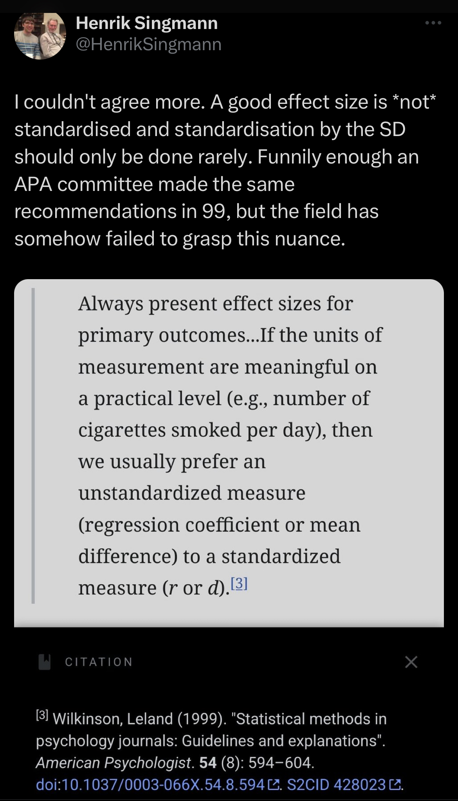

# Waste basket

## Repeated measures and the independence assumption

Two events $A$ and $B$ are independent if the occurrence (or absence) of neither is unaffected by
the occurrence (or absence) of the other. That is, the following must hold:

$$P(A \mid B) = P(A) \text{ and } P(B \mid A) = P(B) $$

A shorter (by in my view less intuitive) formulation is this:

$$P(A \cap B) = P(A)P(B)$$


## Contrast coding and interactions

NOTE: Contrast coding only applies when categorical predictors are used. With continuous predictors, this is not needed.

sum-coding has important advantages when interactions are present

To check the contrasts that R assigns to a factor, use the `contrasts` command. To change the contrast coding, we can do something like this:

```{r contrasts}
x <- factor(c("A", "B"))
# check the contrasts
contrasts(x)

# change to sum-conding
contrasts(x) <- contr.sum(2)
contrasts(x)

# go back to treatment coding
contrasts(x) <- contr.treatment(2)
contrasts(x)
```

(There are other ways of changing this. Most packages offer a contrast coding argument in the relevant call to the regression function. But this one is much more explicit.)

## Effect size

```{r effsize}
library(effsize)
diamonds_sub %>%
    cohen.d(price ~ color, data = .)
```

$$d = \frac{\bar{x}_1-\bar{x}_2}{s}$$

```{r p_effsize}
diamonds_sub %>%
    ggplot(aes(x = price, fill = color, color = color)) +
    geom_density(alpha = .5)
```

## Power calculations for mixed models

While we can often estimate a studies power a priori for simple tests, for mixed models this is not so easy. One way to do with is via simulations. 

The `simr` package might be used to do this.

## What random effects should I specify?

Approaches differ. 

Some people argue for parsimonious models: @matuschek2017type.

Others prefer the most maximal random effects structure: @barr2013randomeffects.

The most common way in the field currently seems to be the second one, but I am not so sure this is right.

## Differences between linear and generalized linear models

**Linear models (LM)** describe a linear relationship between the response variable and the predictors. The linear relationship is found in the raw data. The residuals are captured via the epsilon in the model model formula.

$$y_i = \beta_0 + \beta_1x_i + \epsilon$$

The probability distribution of the response variable is assumed to be the normal distribution.

Assumes variance homogeneity.

**Generalized linear models (GLN)** describe a relationship between the mean of the response variable and the predictors. The linear approximation of the mean is established via a link function ($f$ below) -- logistic regression used log-odds, Poisson regression uses natural log. Since only conditional means are modelled, there is no error term: 

$$f(\mu_{y|x}) = \beta_0 + \beta_1x_i$$

The probability distribution of the response variable varies by the kind of family: Poisson, binomial. etc.

Variance homogeneity is impossible for Poisson regression, it is always heteroscedastic: Since the Poisson distribution depends only on the a single parameter, as the mean increases, so does the variance. 

Because of the single parameter that the poisson distribution estimates, its assumption is that the mean and the variance of the response are equal. If this is not the case, then the model is overdispersed, and should not be used to calculate significance, as it underestimates the standard errors and thus becomes anticonservative. Alternative models in these situations are the quasipoisson model, where the standard errors are articificially inflated to correct for the assumption violation or the negative binomial model, which has an additional parameter. But note that negative binomial models assume that mean and variance are not equal, so they shoul not be used when the assumptions of the Poisson regression are met.


## What are random effects?

Across participants (and items) the average adjustment required to account for differences will be zero: Some will be faster, and some will be slower. This is the nature of random effects.
This is why in the model output of a linear mixed model, you will never see an estimate (a mean) for the random effects: They are always zero. But they do have some variance, which is reported. (Together will the residuals, these also a random effect with mean zero and some unknown variance estimated by the model)

Fixed effects, of course, are completely different and will have both estimated mean and variance.


## Probability

All from @bertsekas2008introduction

A probability problem can usually be broken down into a few basic steps:

a. The description of the sample space, that is, the set of possible outcomes of a given experiment.
b. The (possibly indirect) specification of the probability law (the probability of each event).
b. The calculation of probabilities and conditional probabilities of various events of interest.

The probabilities of events must satisfy the nonnegativity, additivity, and normalization axioms. In the important special case where the set of possible outcomes is finite, one can just specify the probability of each outcome and obtain the probability of any event by adding the probabilities of the elements of the events.

Given a probability law, were are often interested in conditional probabilities, which allow us to reason based on partial information about the outcome of the experiment. We can view conditional probabilities as probability laws of a special type, under which only outcomes contained in the conditioning event can have positive conditional probability. 

### Axioms

- **Nonnegativity**: $P(A) >= 0$, for every event $A$
- **Additivity**: If $A$ and $B$ are two disjoint events, then the probability of their union satisfies: $P(A \cup B) = P(A) + P(B)$.
- **Normalization**: The probability of the entire sample space $\sigma$ is equal to $1$, that is, $P(\sigma) = 1.$

Additional properties of probability law, which can be derived from the axioms above, is that the probability of the empty event is $0$, $P(\emptyset) = 0$.

Here are some more:

- If $A \subset B$, then $P(A) <= P(B)$
- $P(A \cup B) = P(A) + P(B) - P(A \cap B)$
- $P(A \cup B) <= P(A) + P(B)$
- $P(A \cup B \cup C) = P(A) + P(B \ A) + P(C \ B \ A )$

### Conditional Probability

$P(A | B) = \frac{\text{number of elements of } A \cap B}{\text{number of elements of }B}$

more generally:

$P(A | B) = \frac{P(A \cap B)}{P(B)}$

### Toal Probability Theorem

Let $A_1, \ldots{}, A_n$ be disjoint events that form a partition of the sample space and assume that $P(A_i) > 0$, for all $i$. Then, for any event $B$, we have

$$ P(B) = P(A_1 \cap B) + \ldots + P(A_n \cap B)
 = P(A_1)P(B|A_1) + \ldots + P(A_n)P(B | A_n).
$$

### Bayes' Rule

Let $A_1. A_2, \ldots, A_n$ be disjoint events that form a partition of the sample space, and assume that $P(A_i) > 0$, for all $i$. Then, for any event $B$ such that $P(B) > 0$, we have

$$
P(A_i | B) = \frac{P(A_i)P(B | A_i)}{P(B)}

= \frac{P(A_i)P(B | A_i)}{ = P(A_1)P(B|A_1) + \ldots + P(A_n)P(B | A_n)}
$$

In inference, we refer to P(A_i | B) as the posterior probability of event $A_i$ (for $A_i$ as causal events of some effect event $B$). The prior probability of $A_i$ is $P(A_i)$.

Note: Independence between $A$ and $B$ exists if the following holds: $P(A | B) = P(A)$. An alternative definition is this: $P(A \cap B) = P(A)P(B)$. This definition is nice because it also works when $P(B) = 0$. The first definition is simply undefined in that case.

### The Counting Principle

Consider a process that consists of $r$ stages. Suppose that:

a. There are $n_1$ possible results at this first stage.
b. Foe every possible result at the first stage, there are $n_2$ possible results at the second stage.
b. More generally, the any sequence of possible results at the first $i-1$ stages, there are $n_i$ possible results at the $i$th stage. Then, the total number of possible results of the $r$-stage process is: $n_1n_2\ldots{}n_r$

### Summary of Countin Results

- **Permutations** of $n$ objects: $n!$
- $k$-**Permutations** of $n$ objects: $n!/(n-k)!$
- Combinations of $k$ out of $n$ objects: $$\left(
    \begin{array}{c}
        n\\
        k\\
    \end{array}\right) = \frac{n!}{k!(n-k)!}$$.
- **Partitions** of $n$ objects into $r$ groups, with the $i$th group having $n_i$ objects:

 $$\left(
    \begin{array}{c}
        n\\
        n_1,n_2,\ldots{},n_i\\
    \end{array}\right) = \frac{n!}{n_1!n_2!\ldots{}n_r!}$$.

## Generalized Linear Models in Plots

Need a link function because they're not continuous but discrete. For $Bernoulli$/$Binomial$ models, we thus use log-odds as a link function:

$$
Bernoulli(\theta)
$$

$$
log(\frac{\theta}{1-\theta})
$$

Here is an example of what this does graphically, but see also `qlogit(x)` for the logit function and `plogit(x)` for the inverse logit function.

```{r logodds}
x <- seq(0.001, 0.99, by = 0.001)
y <- log(x / (1 - x))

tibble(theta = x, eta = y) %>%
    ggplot(aes(x = theta, y = eta)) +
    geom_line() +
    annotate(
        "text",
        x = .3,
        y = 4,
        label = expression(paste(eta, "=", g(theta))),
        parse = TRUE,
        size = 8
    ) +
    labs(
        title = "Logit link",
        x = "\u03b8",
        y = "\u03b7"
    )
```

```{r loggoddsinv}
tibble(theta = x, eta = y) %>%
    ggplot(aes(x = eta, y = theta)) +
    geom_line() +
    annotate(
        "text",
        x = -4,
        y = .8,
        label = expression(paste(theta, "=", g^-1 ~ (eta))),
        parse = TRUE,
        size = 8
    ) +
    labs(
        title = "Inverse logit link",
        x = "\u03b7",
        y = "\u03b8"
    )
```

## Pretty vs. ugly plots

:

> my students crushed their good plot/bad plot assignment and really took making the worst plots possible to heart.

```{r embedtweet}
# devtools::install_github("gadenbuie/tweetrmd")

# necessary if your output type is not html (as far as I can tell)
# devtools::install_github("rstudio/webshot2")

# this is a webshot2 requirement
# install.packages("magick")

library(twittrmd)
include_tweet("https://twitter.com/NSilbiger/status/1642006294520561666?s=20")
```

## allfit

```{r}
fit <- lmer(judgment ~ stage * issue * trigger_cat + (1 | id) + (1 | item),
    data = d, REML = TRUE
)
# fit with all available optimizers, make sure that 'dfoptim' and 'optimx'
# are installed
multi_fit <- allFit(fit)
# show results
summary(multi_fit)$fixef
```

## Reporting statistics: effect sizes




@wilkinson1999methods
